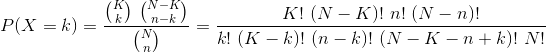

[](http://www.repostatus.org/#inactive) [](https://www.gnu.org/licenses/gpl-3.0.en.html) [](https://travis-ci.org/privefl/primefactr) [](https://codecov.io/gh/privefl/primefactr)

------------------------------------------------------------------------

[](https://cran.r-project.org/) [](https://cran.r-project.org/package=primefactr)

[](commits/master)

------------------------------------------------------------------------

[](/commits/master)

<!-- README.md is generated from README.Rmd. Please edit that file -->
primefactr
==========

R package that uses Prime Factorization for computations.

This small R package was initially developed to compute [hypergeometric probabilities](https://en.wikipedia.org/wiki/Hypergeometric_distribution) which are used in Fisher's exact test, for instance.

Installation and Attachment
---------------------------

``` r
## Installation
install.packages("primefactr")

## Attachment
library("primefactr")
```

Features
--------

### Main feature

To compute , you can use `ComputeDivFact(c(K, (N-K), n, (N-n)), c(k, (K-k), (n-k), (N-K-n+k), N))`. This uses a Prime Factorization to simplify computations.

### Play with primes

You can also test if a number is a prime and get all prime numbers up to a certain number.
